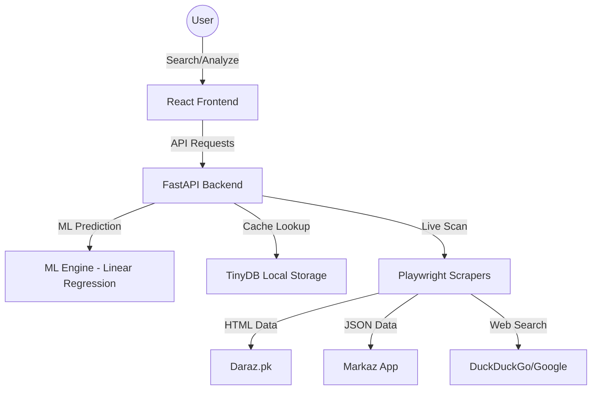

# PakPick AI: E-Commerce Analytics & Arbitrage Engine 🚀

**PakPick AI** is a professional-grade business intelligence tool designed for the Pakistani e-commerce market. It empowers entrepreneurs to discover high-potential products, analyze market trends, and calculate arbitrage opportunities across major platforms like **Daraz** and **Markaz**.

This project was developed as a Final Year Project (FYP) to bridge the gap between wholesale sourcing and retail demand using Machine Learning and Automated Web Scraping.

---

## ✨ Core Features

### 📊 Real-Time Market Intelligence
- **Intelligent Scraping:** Multi-threaded scraping engine for Daraz and Markaz using Playwright and Stealth modules.
- **SERP Integration:** Deep-web discovery via search engine results aggregation to find off-platform trends.
- **Authentic Data:** Extracts real review counts, ratings, and high-resolution product images.

### 🤖 AI-Driven Forecasting
- **Linear Regression Model:** Deterministic sales forecasting based on historical demand trends.
- **Deterministic Graphs:** Seed-based trend generation ensuring consistent data visualization for specific products.
- **Confidence Scoring:** ML-calculated reliability scores for every prediction.

### 💸 Financial & Arbitrage Tools
- **Cross-Platform Comparison:** Automated ROI calculation comparing retail (Daraz) vs Wholesale (Markaz) prices.
- **Dynamic Profit Calculator:** Real-time margin calculator including platform fees (VAT, Commission, Handling).
- **Business Case Generator:** One-click "Confidential Business Report" generation for procurement planning.

### 📈 Smart Dashboard
- **Auto-Pilot Refresh:** Background worker that scans the market every 24 hours for emerging trends.
- **Dynamic Keyword Analytics:** Trending keywords derived from actual user search behavior and local caching.
- **Seasonal Analysis:** Intelligent filtering to detect summer/winter/event-based viral products.

---

## 🏗️ Technical Architecture



---

## 🛠️ Tech Stack

- **Frontend:** React 19, TypeScript, Vite, Tailwind CSS, Framer Motion, Recharts, Lucide Icons.
- **Backend:** Python 3.13, FastAPI, Playwright (Automation), TinyDB (NOSQL), Scikit-learn (ML Logic).
- **Automation:** Personal Access Tokens for SERP, Stealth-Playwright for bot-bypass.

---

## 🚀 Installation & Setup

### Prerequisites
- Node.js (v18+)
- Python (v3.10+)

### 1. Clone the repository
```bash
git clone https://github.com/wahabmd/PakPick.git
cd PakPick
```

### 2. Backend Setup
```bash
cd backend
pip install -r requirements.txt
python run.py
```

### 3. Frontend Setup
```bash
npm install
npm run dev
```

---

## 🌐 Deployment

### Frontend (Vercel)
The project includes a `vercel.json` and `.env.example`. 
1. Push to GitHub.
2. Import to Vercel.
3. Add Environment Variable: `VITE_API_URL=https://your-backend-url.com`.

---

## 📜 Future Roadmap
- [ ] Integration with Alibaba Cloud for global sourcing data.
- [ ] WhatsApp API notifications for price drops.
- [ ] Multi-vendor dropshipping dashboard.

---

## 👨‍💻 Author
**Wahab** 
*Final Year Project - Computer Science*
[GitHub Profile](https://github.com/wahabmd)

---
*Disclaimer: This tool is for research and educational purposes only. Always comply with the Terms of Service of the respective platforms.*
